```mermaid
graph TD

CAP["CAP Theorem"]
PACELC["PACELC Theorem"]
SCAL["Scalability"]
FT["Fault Tolerance"]
REPL["Replication & Sharding"]

CAP --> PACELC
CAP --> REPL
SCAL --> REPL
SCAL --> FT

BATCH["Batch Processing"]
STREAM["Stream Processing"]
LAMBDA["Lambda Architecture"]
KAPPA["Kappa Architecture"]
EDR["Event Driven Architecture"]

BATCH --> LAMBDA
STREAM --> LAMBDA
STREAM --> KAPPA
STREAM --> EDR

HDFS["HDFS"]
OBJ["Object Storage"]
PART["Data Partitioning"]
LOCAL["Data Locality"]

PART --> HDFS
PART --> OBJ
LOCAL --> HDFS

MAPR["MapReduce"]
SCHED["Task Scheduling"]
PARA["Data vs Task Parallelism"]
CLUSTER["Cluster Computing"]

CLUSTER --> MAPR
CLUSTER --> SCHED
LOCAL --> MAPR
PARA --> MAPR

QUEUE["Message Queues vs Streaming"]
KAFKA["Kafka Architecture"]
DELIV["Delivery Semantics"]
CONS["Consumer Groups"]

QUEUE --> KAFKA
KAFKA --> CONS
KAFKA --> DELIV

EVTUAL["Eventual Consistency"]
STRONG["Strong Consistency"]
IDEMP["Idempotency"]
RETRY["Retries & Backoff"]
DLQ["Dead Letter Queue"]

CAP --> EVTUAL
CAP --> STRONG
RETRY --> DLQ
IDEMP --> RETRY
DELIV --> IDEMP

LOAD["Load Balancing"]
BACK["Backpressure"]
CB["Circuit Breaker"]
SD["Service Discovery"]
LEADER["Leader Election"]

SCAL --> LOAD
BACK --> KAFKA
FT --> CB
CLUSTER --> SD
CLUSTER --> LEADER

LAT["Latency vs Throughput"]
SKEW["Data Skew"]
CACHE["Caching"]

PART --> SKEW
CACHE --> LAT
LAT --> MAPR

ETL["ETL vs ELT"]
LAKE["Data Lake vs Warehouse"]
LAKEHOUSE["Lakehouse Architecture"]
SCHEMA["Schema Evolution"]

OBJ --> LAKE
LAKE --> LAKEHOUSE
ETL --> BATCH
SCHEMA --> LAKEHOUSE
```

**Core Fundamentals**  
CAP Theorem (Consistency, Availability, Partition Tolerance)  
PACELC Theorem (extension of CAP for latency vs consistency tradeoff)  
Horizontal vs Vertical Scaling  
Replication & Sharding  
Fault Tolerance

**Data Processing Models**  
Batch Processing vs Stream Processing  
Lambda Architecture  
Kappa Architecture  
Event-Driven Architecture

**Distributed Storage Systems**  
Distributed File Systems (HDFS)  
Object Storage (S3, GCS, ADLS)  
Data Partitioning Strategies  
Data Locality Principle

**Distributed Computing Concepts**  
MapReduce Model  
Distributed Task Scheduling  
Data Parallelism vs Task Parallelism  
Cluster Computing

**Messaging & Streaming Systems**  
Message Queues vs Streaming Systems  
Kafka Architecture (brokers, partitions, offsets)  
Exactly-once vs At-least-once vs At-most-once delivery  
Consumer Groups & Offset Management

**Consistency & Reliability**  
Eventual Consistency  
Strong Consistency  
Idempotency in distributed systems  
Retries, Backoff Strategies  
Dead Letter Queues (DLQ)

**System Reliability & Design**  
Load Balancing  
Backpressure Handling  
Circuit Breaker Pattern  
Service Discovery  
Leader Election

**Performance & Optimization**  
[[Partitioning & Bucketing]] 
Caching in distributed systems  
Data skew handling  
Throughput vs Latency tradeoffs

**Data Engineering Specific Concepts**  
ETL vs ELT in distributed systems  
Data Lake vs Data Warehouse architecture  
Lakehouse architecture (Delta Lake / Iceberg / Hudi)  
Schema evolution in distributed pipelines

