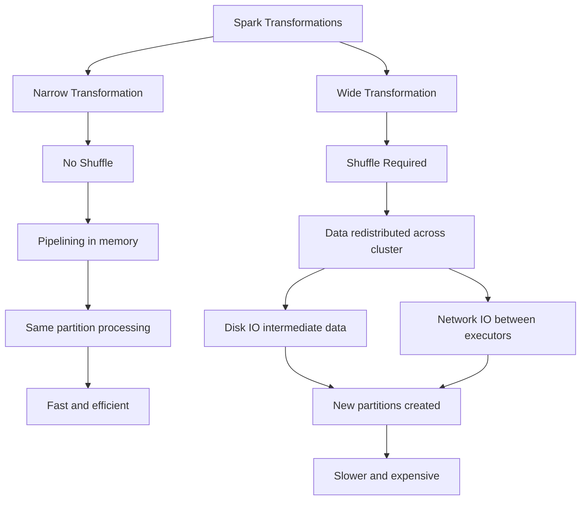

## # Partitions 

To allow every executor to perform work in parallel, Spark breaks up the data into chunks.
A partition is a collection of rows that **sit on one physical machine** in your cluster. 

>A DataFrame’s partitions represent how the data is physically distributed across the cluster of machines during execution. 

If you have one partition, Spark will have a parallelism of only one, even if you have thousands of executors. If you have many partitions but only one executor, Spark will still have a parallelism of only one because there is only one computation resource.

> With DataFrames you do not (for the most part) manipulate partitions manually or individually. You simply specify high-level transformations of data in the physical partitions, and Spark determines how this work will actually execute on the cluster.
### # Transformations

In Spark, the core data structures are immutable, meaning they cannot be changed after they’re created. To “change” a DataFrame, you need to instruct Spark how you would like to modify it to do what you want. These instructions are called transformations.

Transformations resturns no output.  This is because Spark will not act on transformations until we call an action. Transformations are the core of how you express your business logic using Spark. There are two types of transformations: those that specify narrow dependencies, and those that specify wide dependencies.
#### # Narrow transformation

In narrow transformation each input partition will contribute to only one output partition
There is no [[Shuffling]]; no movement of data between partitions (all operations happen on the same partition)

![[Pasted image 20260522223951.png]]

Narrow transformations are typically **very efficient** because they:

- Do not require data movement across the cluster
- Do not involve network or disk overhead
- Allow **pipelining of operations in-memory**

```
map  
- Applies a function to each element within the same partition.  
- No data is moved across executors.  
  
filter  
- Keeps only rows that satisfy a condition.  
- Works within the same partition.  
  
select  
- Chooses specific columns from a DataFrame.  
- No reshuffling of data.  
  
withColumn  
- Adds or modifies a column in each row independently.  
- Executed within each partition.  
  
union (in many cases)  
- Combines datasets without redistributing data (if partitions align).
``` 
#### # Wide transformation

Input partitions contribute to many output partitions. Data must be **repartitioned (exchanged) across the cluster**.

![[Pasted image 20260522224638.png]]

Wide transformations can be more expensive than narrow transformations, as they can involve significant data movement.

```
groupBy  
- Groups data by key across all partitions.  
- Requires moving same keys to the same partition.  
  
join  
- Combines two datasets based on a key.  
- Data must be shuffled so matching keys meet.  
  
orderBy / sort  
- Sorts entire dataset globally.  
- Requires redistribution of all data.  
  
distinct  
- Removes duplicates across partitions.  
- Data is shuffled to compare all values.  
  
reduceByKey  
- Aggregates values by key.  
- Requires grouping same keys across partitions.  
  
repartition  
- Explicitly redistributes data into new partitions.  
- Forces full shuffle of dataset.
```
##### Narrow vs Wide (Execution Behavior)

With narrow transformations, Spark will automatically perform an operation called [[Pipelining]], meaning that if we specify multiple filters on DataFrames, they’ll all be performed in-memory. 

> Wide transformations are a **logical concept.** 
> Shuffle is a physical execution of wide  mechanism used to implement **wide transformations**. During a shuffle, Spark writes intermediate data to disk and transfers it across the network between executors.





### # Lazy Evaluation 

Lazy evaulation means that **Spark will wait until the very last moment to execute the graph of**
**computation instructions.** 

In Spark, instead of modifying the data immediately  you build up a plan of transformations that you would like to apply. By waiting until the last minute to execute the code, Spark compiles this plan from your raw DataFrame transformations to a streamlined physical plan that will run as efficiently as possible across the cluster. 

**Spark can optimize the entire data flow from end to end**. An example of this is something called [[Predicate Pushdown]] on DataFrames. If we build a large Spark job but specify a filter at the end that only requires us to fetch one row from our source data, the most efficient way to execute this is to access the single record that we need. Spark will actually optimize this for us by pushing the filter down automatically.
### # Actions 

**Transformations** allow us to build up our **logical transformation plan**. **To trigger the computation, we run an action**.
An **action** instructs Spark to compute a result from a series of transformations. There are three kinds of actions:

- Actions to view data in the console
- Actions to collect data to native objects in the respective language
- Actions to write to output data sources

### # Execution Flow

In Spark, you first write **transformations**, which include both narrow and wide transformations, and Spark does not execute them immediately because of lazy evaluation. These transformations are used to build a logical execution plan i.e [[Directed Acyclic Graph (DAG)]]. When you call an **action** (such as `count()`, `collect()`, or `show()`), Spark triggers execution of the entire plan.

During execution, Spark processes **narrow transformations first where possible**, using pipelining to execute operations in-memory within the same partition. When it encounters a **wide transformation**, it performs a **shuffle**, redistributing data across the cluster and creating stage boundaries. After all transformations are executed, the action completes and the final result is returned to the driver.